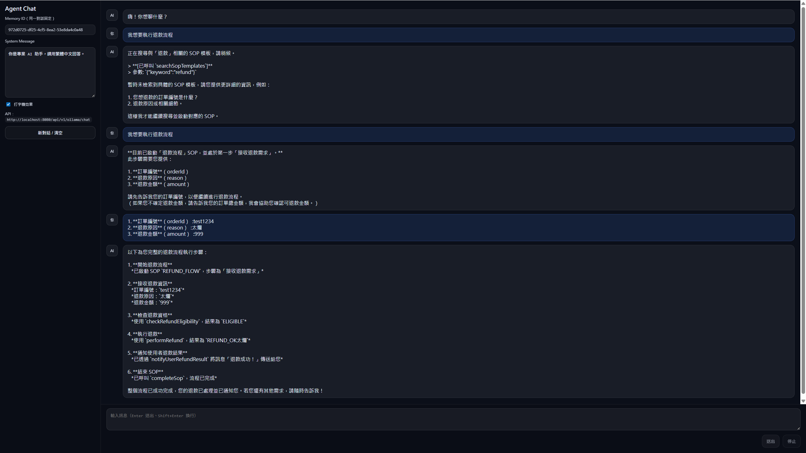
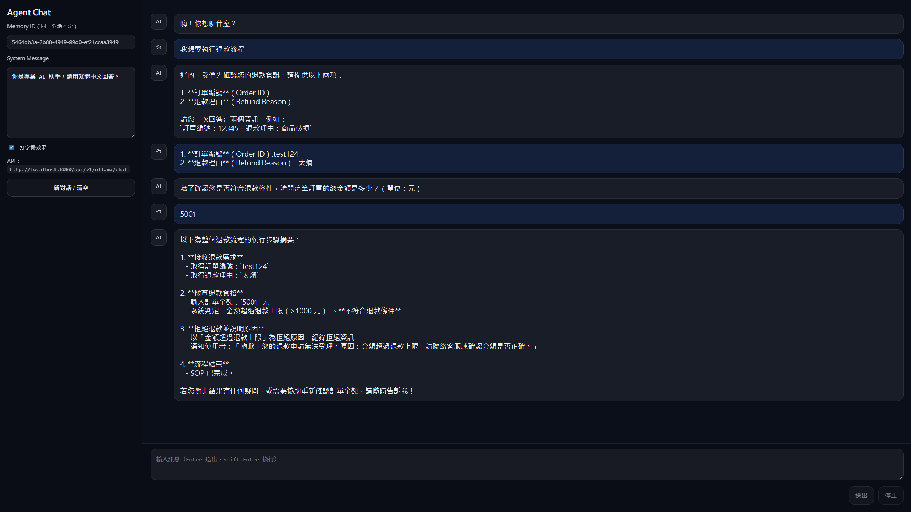

# 🚀 AgentPortal

AgentPortal is an intelligent AI agent platform designed to interpret and execute complex, branched **Standard Operating Procedures (SOPs)**. It uses **Neo4j** as a knowledge graph and **LangChain4j** for orchestration to translate high-level natural language instructions into low-level executable steps.

AgentPortal 是一套 AI 流程代理平台，能夠理解並執行複雜的 SOP（標準作業流程），並以 Neo4j 知識圖譜與 LangChain4j 做為核心架構來執行標準作業流程。

---

## 📌 Features / 功能特色

- 🧠 **Natural Language Input** – Users provide instructions in plain text.  
- 📊 **Knowledge Graph** – SOP and workflow structures stored in Neo4j.  
- 🔄 **Dynamic Execution** – Handles decision branches and conditional logic.  
- 🧩 **Agent Orchestration** – Utilizes LangChain4j to plan and run execution steps.  
- 🔌 **Extensible Framework** – Easily integrate tools or extend workflows.

---

## 📸 Demo / 執行畫面示例

### Execution Screenshot 1

### Execution Screenshot 2
