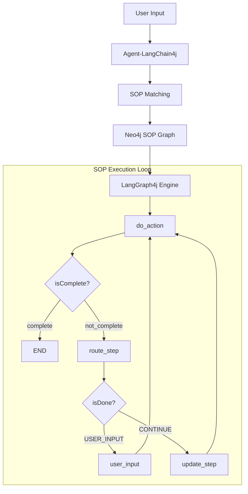
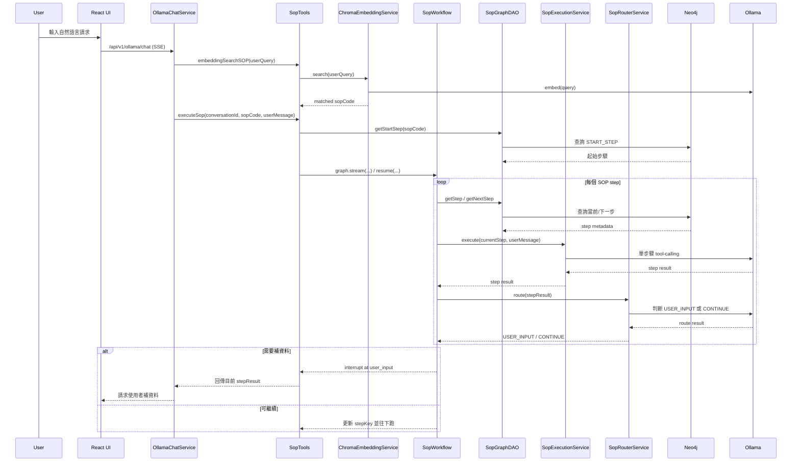

# 🚀 AgentPortal

AgentPortal 是一個 **AI-driven SOP Workflow Engine**，  
能將使用者的自然語言需求，自動轉換為可執行的標準作業流程（SOP）。

系統整合 LLM、知識圖譜與流程引擎，讓流程不再是寫死的邏輯，而是可以被 AI 理解與決策的動態系統。

---
## ✨ Core Concept

傳統流程系統：
- 使用 if/else 或 BPMN 寫死邏輯
- 難以維護與擴展
- 無法處理不完整輸入

AgentPortal：
- SOP = Graph（Neo4j）
- Decision = LLM（Ollama）
- Execution = Workflow Engine（LangGraph4j）

👉 流程由 AI 決定，而不是工程師硬編碼

---

## 🏗️ Architecture Overview

系統主要由三個核心層組成：

### 1️⃣ Interaction Layer
- React + Vite 前端
- 提供聊天式 UI
- 與後端透過 API / SSE 溝通

---

### 2️⃣ Agent Layer（核心）

主要由 LangChain4j 驅動：

#### OllamaChatService
- 主 Agent（AI 助手）
- 判斷是否需要啟動 SOP
- 呼叫工具（SopTools）

#### SopTools
- LLM 可呼叫的工具入口
- 功能：
  - SOP 搜尋（透過 Chroma）
  - SOP 執行（透過 Workflow）

---

### 3️⃣ Workflow Layer（流程引擎）

#### SopWorkflow（LangGraph4j）
- 控制 SOP 執行流程
- 支援：
  - 多步驟流程
  - 中斷（interrupt）
  - 回復（resume）

流程節點包含：
- do_action
- route_step
- user_input
- update_step

---

### 4️⃣ Execution Layer（執行層）

#### SopExecutionService
- 負責執行單一 SOP step
- 使用 LLM + Tool calling

#### SopRouterService
- 判斷：
  - step 是否完成
  - 是否需要補參數

---

### 5️⃣ Data Layer

#### Neo4j（SOP Graph）
儲存：
- SopTemplate
- SopStep
- NEXT 關係（流程轉換）

#### Chroma（Vector DB）
- SOP embedding
- 語意搜尋 SOP

---

### 6️⃣ External AI

#### Ollama
- Chat model（對話與決策）
- Embedding model（語意搜尋）

---

## 🔁 SOP Execution Flow


```mermaid
flowchart TD

    A[User Input] --> B[Agent-LangChain4j]
    B --> C[SOP Matching]
    C --> D[Neo4j SOP Graph]

    D --> E[LangGraph4j Engine]

    subgraph SOP Execution Loop
        E --> F[do_action]
        F --> G{isComplete?}

        G -->|complete| Z[END]
        G -->|not_complete| H[route_step]

        H --> I{isDone?}

        I -->|USER_INPUT| J[user_input]
        I -->|CONTINUE| K[update_step]

        J --> F
        K --> F
    end
```

---
## 🗂️ Project Structure
```
agenticPortal-BE
├── agent          # Chat Agent
├── tools          # Tool layer
├── sop            # SOP workflow + DAO
├── chroma         # Embedding service
├── config         # LLM / Graph config
└── controller     # REST API
```
## 🧑‍💻 Sequence Diagram

```mermaid
sequenceDiagram
    participant User
    participant FE as React UI
    participant Chat as OllamaChatService
    participant Tools as SopTools
    participant Chroma as ChromaEmbeddingService
    participant WF as SopWorkflow
    participant DAO as SopGraphDAO
    participant Exec as SopExecutionService
    participant Router as SopRouterService
    participant Neo4j
    participant Ollama

    User->>FE: 輸入自然語言請求
    FE->>Chat: /api/v1/ollama/chat (SSE)

    Chat->>Tools: embeddingSearchSOP(userQuery)
    Tools->>Chroma: search(userQuery)
    Chroma->>Ollama: embed(query)
    Chroma-->>Tools: matched sopCode

    Chat->>Tools: executeSop(conversationId, sopCode, userMessage)
    Tools->>DAO: getStartStep(sopCode)
    DAO->>Neo4j: 查詢 START_STEP
    Neo4j-->>DAO: 起始步驟

    Tools->>WF: graph.stream(...) / resume(...)
    loop 每個 SOP step
        WF->>DAO: getStep / getNextStep
        DAO->>Neo4j: 查詢當前/下一步
        Neo4j-->>DAO: step metadata

        WF->>Exec: execute(currentStep, userMessage)
        Exec->>Ollama: 單步驟 tool-calling
        Ollama-->>Exec: step result
        Exec-->>WF: step result

        WF->>Router: route(stepResult)
        Router->>Ollama: 判斷 USER_INPUT 或 CONTINUE
        Ollama-->>Router: route result
        Router-->>WF: USER_INPUT / CONTINUE
    end

    alt 需要補資料
        WF-->>Tools: interrupt at user_input
        Tools-->>Chat: 回傳目前 stepResult
        Chat-->>FE: 請求使用者補資料
    else 可繼續
        WF-->>Tools: 更新 stepKey 並往下跑
    end
```